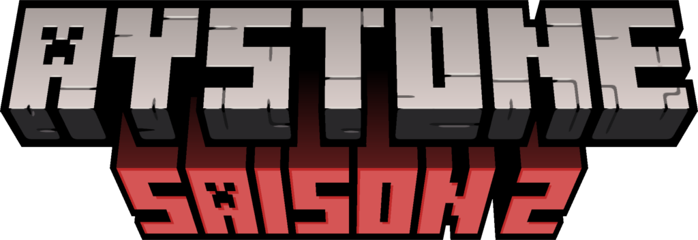

# Aystone



---

## Description

Aystone Manager est une application web de gestion de projets Minecraft, pensée spécialement pour la communauté du serveur **Aystone**.  
Elle permet aux joueurs d’ajouter, modifier et suivre leurs projets dans différents mondes Minecraft : Overworld, Nether et End.

---

## Fonctionnalités principales

- Ajouter, modifier et suivre les projets Minecraft par joueur.
- Filtrage avancé par joueur, état, monde et tags (usine, spawn, build).
- Interface réactive et intuitive, réalisée avec Next.js, React 18 et Tailwind CSS.
- Animation de particules "redstone" sur le logo grâce à un canvas personnalisé.
- Système d'authentification simple via pseudo Minecraft (sans mot de passe ni token stocké).
- Intégration avec un dashboard utilisateur personnalisé.
- Support pour copier facilement les coordonnées dans le presse-papiers.
- Lancement sur une instance **Coolify** pour la facilité de déploiement.

---

## Technologies utilisées

- [Next.js 15](https://nextjs.org/)
- [React 18](https://reactjs.org/)
- [Tailwind CSS 4.1](https://tailwindcss.com/)
- [TypeScript 5.8](https://www.typescriptlang.org/)
- [Framer Motion](https://www.framer.com/motion/)
- [Lucide React](https://lucide.dev/)
- Déploiement avec [Coolify](https://coolify.io/)

---

## Installation

1. Cloner ce dépôt :

```bash
git clone https://github.com/UltraLionfr/aystone-manager.git
cd aystone-manager
````

2. Installer les dépendances :

```bash
pnpm install
```

3. Lancer le serveur de développement :

```bash
pnpm dev
```

4. Ouvrir `http://localhost:3000` dans votre navigateur.

---

## Utilisation

* Pour accéder au dashboard et ajouter un projet, il suffit de renseigner son pseudo Minecraft à la connexion.
* Aucun mot de passe ni token n’est stocké, garantissant simplicité et confidentialité.

---

## Contribution

Toute contribution est bienvenue !
N’hésitez pas à ouvrir une issue ou faire une pull request.

---

## Licence

Ce projet est sous licence MIT.

---

## Contact

Pour toute question ou suggestion :
[https://ultralion.xyz](https://ultralion.xyz)

---

## Remerciements

* Inspiré par les google sheet de la commu
* Basé sur les technologies modernes de l'écosystème React et Next.js.

---

*Ce projet n'est pas affilié à Mojang/Microsoft.*